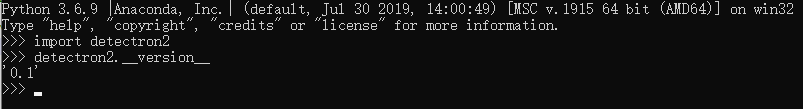

### Requirements
- Python >= 3.6(Conda)
- PyTorch 1.3
- [torchvision](https://github.com/pytorch/vision/) that matches the PyTorch installation.
	You can install them together at [pytorch.org](https://pytorch.org) to make sure of this.
- OpenCV, needed by demo and visualization
- [fvcore](https://github.com/facebookresearch/fvcore/): `pip install git+https://github.com/facebookresearch/fvcore`
- pycocotools: `pip install cython; pip install git+https://github.com/philferriere/cocoapi.git#subdirectory=PythonAPI`
- VS2019(no test in older version)/CUDA10.1(no test in older version)

### several files must be changed by manually.
```
file1: 
  {your evn path}\Lib\site-packages\torch\include\torch\csrc\jit\argument_spec.h
  example:
  {C:\Miniconda3\envs\py36}\Lib\site-packages\torch\include\torch\csrc\jit\argument_spec.h(190)
    static constexpr size_t DEPTH_LIMIT = 128;
      change to -->
    static const size_t DEPTH_LIMIT = 128;
file2: 
  {your evn path}\Lib\site-packages\torch\include\pybind11\cast.h
  example:
  {C:\Miniconda3\envs\py36}\Lib\site-packages\torch\include\pybind11\cast.h(1449)
    explicit operator type&() { return *(this->value); }
      change to -->
    explicit operator type&() { return *((type*)this->value); }
```

### Build detectron2

After having the above dependencies, run:
```
conda activate {your env}

"C:\Program Files (x86)\Microsoft Visual Studio\2019\Enterprise\VC\Auxiliary\Build\vcvars64.bat"

git clone https://github.com/conansherry/detectron2

cd detectron2

python setup.py build develop
```
Note: you may need to rebuild detectron2 after reinstalling a different build of PyTorch.

<div align="center">
  
</div>


Detectron2 is Facebook AI Research's next generation software system
that implements state-of-the-art object detection algorithms.
It is a ground-up rewrite of the previous version,
[Detectron](https://github.com/facebookresearch/Detectron/),
and it originates from [maskrcnn-benchmark](https://github.com/facebookresearch/maskrcnn-benchmark/).

<div align="center">
  
</div>

### What's New
* It is powered by the [PyTorch](https://pytorch.org) deep learning framework.
* Includes more features such as panoptic segmentation, densepose, Cascade R-CNN, rotated bounding boxes, etc.
* Can be used as a library to support [different projects](projects/) on top of it.
  We'll open source more research projects in this way.
* It [trains much faster](https://detectron2.readthedocs.io/notes/benchmarks.html).

See our [blog post](https://ai.facebook.com/blog/-detectron2-a-pytorch-based-modular-object-detection-library-/)
to see more demos and learn about detectron2.

## Installation

See [INSTALL.md](INSTALL.md).

## Quick Start

See [GETTING_STARTED.md](GETTING_STARTED.md),
or the [Colab Notebook](https://colab.research.google.com/drive/16jcaJoc6bCFAQ96jDe2HwtXj7BMD_-m5).

Learn more at our [documentation](https://detectron2.readthedocs.org).
And see [projects/](projects/) for some projects that are built on top of detectron2.

## Model Zoo and Baselines

We provide a large set of baseline results and trained models available for download in the [Detectron2 Model Zoo](MODEL_ZOO.md).


## License

Detectron2 is released under the [Apache 2.0 license](LICENSE).

## Citing Detectron

If you use Detectron2 in your research or wish to refer to the baseline results published in the [Model Zoo](MODEL_ZOO.md), please use the following BibTeX entry.

```BibTeX
@misc{wu2019detectron2,
  author =       {Yuxin Wu and Alexander Kirillov and Francisco Massa and
                  Wan-Yen Lo and Ross Girshick},
  title =        {Detectron2},
  howpublished = {\url{https://github.com/facebookresearch/detectron2}},
  year =         {2019}
}
```
